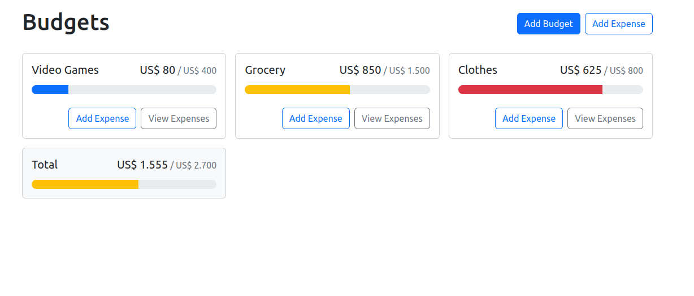

# Budget App - React & Bootstrap 💰💲💰💲💰💲

> # Description 

A Budget application made with React and Bootstrap components. The user can create different types of budgets like studies, health, and bills (including an "uncategorized" type). Users can add or delete expenses within each budget. The information is kept in local storage with a custom hook "useLocalStorage". The application also contains a global context made with the hook useContext.

Available here: [Budget App React - Vítor F. Nery](https://budget-app-vitorfnery.netlify.app/)

## 🛠️ Technologies 

- React
- Bootstrap
- Git and Github
